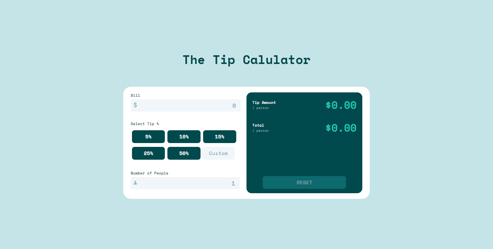

# Frontend Mentor - Tip calculator app solution

This is a solution to the [Tip calculator app challenge on Frontend Mentor](https://www.frontendmentor.io/challenges/tip-calculator-app-ugJNGbJUX). Frontend Mentor challenges help you improve your coding skills by building realistic projects.

## Table of contents

- [Overview](#overview)
  - [The Challenge](#the-challenge)
  - [Screenshot](#screenshot)
  - [Links](#links)
- [My process](#my-process)
  - [Built with](#built-with)
  - [What I learned](#what-i-learned)
  - [Continued development](#continued-development)

## Overview

### The Challenge

Users should be able to:
- View the optimal layout for the app depending on their device's screen size
- See hover states for all interactive elements on the page
- Calculate the correct tip and total cost of the bill per person

### Screenshot

### Links

- Solution URL: [Tip Calculator](https://www.frontendmentor.io/solutions/tip-calculator-with-flexbox-gsKtMkmxZ)
- Live Site URL (hosted on Heroku - may load slow): [Tip Calculator](https://tipcalculatorr.herokuapp.com/)

## My process

I started off with laying out the website for desktop users first, then I wrote the Javascript code for the calculator to function. After that, I then started making it responsive and making adjustments to the layout as needed.

### Built with

- HTML
- CSS
- Flexbox
- [React](https://reactjs.org/) - JS library

### What I learned

Gained a lot of knowledge on positioning, as well as some for javascript/react hooks with coding the calcuator.

### Continued development

I feel that I wanna be able to have it scale vertically as well!
